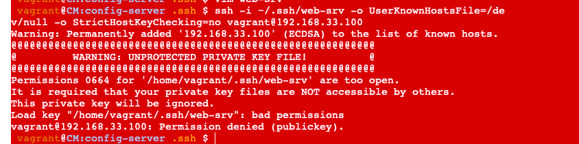

# Conatiner Workshop

Solution for: https://github.com/CSC-DevOps/Course/blob/master/HW/HW2-cm.md

**Name:** Sruthi Talluri 

## Class activities

Describe your discussion for defining idempotency.  What examples did you use for idempotent and not idempotent operations?

I joined the us-east-1 channel at 2:00 pm on Tuesday(02/16/2021) and discussed about the above topics. 

Idempotency: 
An action or operation, which does not affect the state or does not alter the state is an idempotent operation. 

Examples of Idempotent Operations: 

* An GET request does not change any state, or applying it multiple time results in same state. 

* A print operation also many times does not affect the state. 

* Saving an already saved file make no new state changes. 

Examples of Not Idempotent Operations: 

* An POST, PUT or DELETE request changes the state, resulting in addition, modification or removal in data etc. 

* An edit operation on file or rename file operation change the state

## Answer the following conceptual questions 

1. What are the core activities of *traditional* configuration management?

    The core activities of traditional configuration management are: 

    * Identify all items related to software

    * Manage changes to those items

    * Enable variations of items and changes 

    * Maintain quality of versions and releases 

    * Provide traceability between changes and requirements 

2. What are some components of modern configuration management?

    The components of modern configuration management are: 

    * git, branches

    * package managers, task and build managers 

    * Inventory, configuration scripts  etc. 

3. How does modern tooling and software development processes change configuration management for the better?
    
    * Source control already makes easy to identify software components and manage changes 

    * Variations can be enabled with branches and feature flags 

    * Better code review practices + CI/CD pipelines can enable quality control and traceability between requirements and code in production 

4. What are some reasons why dependencies might be difficult to configure for a computing environment?

    * Executable gists are not present, so naive algorithm to enable executable gists 

    * Name Mismatch, transitive dependency, version constraints etc. 

5. Why is idempotency useful for configuration scripts?

    System is able to reach a state regardless of its current state, so in case of missing any information, such idempotent scripts make sure we can get back to the required state. 
     
6. Explain the difference between pull and push configuration models.

    * Push configuration model is easier to manage wheras pull is more complex. 

    * ASSET is managed centrally in push configuration models and in case of pull configuration models it can register itself. 

    * There is less enforcemen of state in case of Push configuration models and in case of pull configuration models there is better ensurance assets stay in sync with config (agent enforces state).

7. Compare and contrast living infrastructure from immutable infrastructure.

    The contrast in living infrastruture and immutable infrastructure is in living infrastruture where an instance stays alive and we keep updating it, and in immutable infrastructure it is erased and recreated everytime. 

8. Explain the difference between provisioning and configuration management.

    The difference between provisioning and configuration is that in provision is what gets up the machine. Either kickstarting a machine, or virt install, or using an API to launch a cloud vm.
    Whereas configuration management is what happens right afterwards. In fact, the last thing a provisioning tool does is launching the configuration management tool.

9. What impact does configuring a server to listen on 0.0.0.0 have? Why might this be a problem?

    It works in browsers but it's bad practice and looks unprofessional. 
    The problem that the port the server listens on has no effect on cookies at all. 0.0.0.0 is used to instruct the server to listen on all available IP addresses but users still connect to a particular port on a particular concrete IP address, and cookies are generated using those values.

10. What is an interesting thing you learned about research in configuration management?

    The interesting thing in configuration management is its helpfullness in team collaborations, with continous deployement and integration. The state being maintained for each feature with no overlap and merge conflicts. 

## Answer the following questions about the CM workshop 

1. How did you create a connection between the configuration server and web server?

    To create a connection between the configuration server and web server we created a pair of public/private keys for authentication through ssh.
    In our case, the public key will be used to authorize the private key for connections to the web-srv. The private key will be stored in the config-server. It can then be used, for example, to make a ssh connection to the web-srv.

2. Did you have any problems getting this setup?

    

    The problem on the private key file was the visibility, in order to overcome, reduced who can read or access this file. 
    
3. Why does the permission of the private key need to be changed?

    The file was visible to all servers, and hence its accessibility was to be changed. 

4. If ssh can be used to execute remote commands, why not just use bash commands for CM?

    While being able to run ad-hoc commands and scripts provides a useful capability, there are several constraints that make this impractical.

    Writing bash scripts can be error-prone. Most commands are not idempotent, meaning they may cause errors or unexpected behaviors if run multiple times on the same servers. Finally, configuration of servers is an inherently noisy problem, due to network issues and random service and hardware failures. This means, you often need to resume a configuration operation after experiencing partial failure.

5. What are some reasons why it is useful to have a configuration server.

   The reasons it is useful is it provides a centralized server for delivering external configuration properties to an application and a central source for managing this configuration across deployment environments 

## Part 3

1. What is your understanding of the `yaml` format?

    `yaml` is a human readable data serializable language better than JSON or XML. It is commonly used for configuration files and in applications where data is being stored or transmitted. 

2. What is the difference between a *module* and *task* in ansible?

    A module is a reusable, standalone script that Ansible runs on your behalf, either locally or remotely. Modules interact with your local machine, an API, or a remote system to perform specific tasks like changing a database password or spinning up a cloud instance.
    Whereas each task executes a module with specific arguments. When a task has executed on all target machines, Ansible moves on to the next task. You can use strategies to change this default behavior. Within each play, Ansible applies the same task directives to all hosts.

3. What are situations where you might use *variables* and *templates* in ansible?

    Ansible provides variables as a way to avoid hard-coding configuration values inside ansible tasks.
    Templates are powerful ways to setup basic configuration settings without hard coding values. When I use a template, it will get the template, fill in any parameters, and then copy the file over to the destination, hence it can be useful for setting up complex configuration files such as apache, mysql, or jenkins.

4. What are some operators that enable idempotence in ansible tasks?

    By default, most ansible modules are written to be idempotent. For example, if one of the tasks is to create a directory on the server, then the directory will be created if and only if it does not already exist. This sounds pretty simple to implement in the case of filesystem operations, but it’s not as trivial when considering more complex modules. Nonetheless, Ansible guarantees idempotence in all of its core modules.

5. Why are roles useful for organizing ansible playbooks?

    Roles allow for you to essentially “include” in other playbooks. Its basically another level of abstraction used to organize playbooks. They provide a skeleton for an independent and reusable collection of variables, tasks, templates, files, and modules which can be automatically loaded into the playbook.
