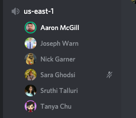

# HW2-DevOps

**Unity Id:** stallur2

**Name:** Sruthi Talluri 

## Class activities

Describe your discussion for defining idempotency.  What examples did you use for idempotent and not idempotent operations?

I joined the us-east-1 channel at 2:00 pm on Tuesday(02/16/2021) and discussed about the above topics. 

Idempotency: 
An action or operation, which does not affect the state or does not alter the state is an idempotent operation. 

Examples of Idempotent Operations: 

* An GET request does not change any state, or applying it multiple time results in same state. 

* A print operation also many times does not affect the state. 

* Saving an already saved file make no new state changes. 

Examples of Not Idempotent Operations: 

* An POST, PUT or DELETE request changes the state, resulting in addition, modification or removal in data etc. 

* An edit operation on file or rename file operation change the state

## Answer the following conceptual questions 

1. What are the core activities of *traditional* configuration management?

    The core activities of traditional configuration management are: 

    * Identify all items related to software

    * Manage changes to those items

    * Enable variations of items and changes 

    * Maintain quality of versions and releases 

    * Provide traceability between changes and requirements 

2. What are some components of modern configuration management?

    The components of modern configuration management are: 

    * git, branches

    * package managers, task and build managers 

    * Inventory, configuration scripts  etc. 

    ---------------------------------------------------------------------------------

    * Source control already makes easy to identify software components and manage changes 

    * Variations can be enabled with branches and feature flags 

    * Better code review practices + CI/CD pipelines can enable quality control and traceability between requirements and code in production 

3. How does modern tooling and software development processes change configuration management for the better?

4. What are some reasons why dependencies might be difficult to configure for a computing environment?

5. Why is idempotency useful for configuration scripts?

6. Explain the difference between pull and push configuration models.

7. Compare and contrast living infrastructure from immutable infrastructure.

8. Explain the difference between provisioning and configuration management.

9. What impact does configuring a server to listen on 0.0.0.0 have? Why might this be a problem?

10. What is an interesting thing you learned about research in configuration management?

## Answer the following questions about the CM workshop 

1. How did you create a connection between between the configuration server and web server?

2. Did you have any problems getting this setup?

3. Why does the permission of the private key need to be changed?

4. If ssh can be used to execute remote commands, why not just use bash commands for CM?

5. What are some reasons why it is useful to have a configuration server.

## Part 3

1. What is your understanding of the `yaml` format?

2. What is the difference between a *module* and *task* in ansible?

3. What are situations where you might use *variables* and *templates* in ansible?

4. What are some operators that enable idempotence in ansible tasks?

5. Why are roles useful for organizing ansible playbooks?